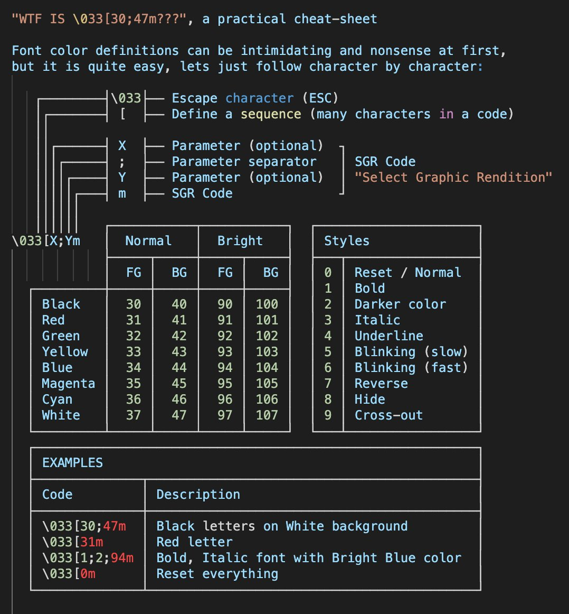

% Ansi escape codes

## Ansi escape codes
Ansi escape codes are used to modify or interact with your terminal's display.
All escape codes start with the __escape sequence__. There are several ways by which
you can insert a __escape sequence__ directly on the command line by pressing
__<Ctrl-V>__+__<Esc>__.
You can insert a __escape sequence__ in literal strings in variables such as
your prompt, e.g. `PS1='\033`, or inside a `printf` command, e.g. `printf '\033'`.
In this cases you can use any of the following representations of the *escape sequence*
if your terminal supports them:

* \<Ctrl-V\>+\<Esc\>: `^[`
* Hexadecimal escape: `\x1b`
* Octal escape: `\033` (**probably the most portable**)
* Unicode escape: `\u001B`

See the following __Stack Overflow__ questions for more information on __escape
sequences__:

* [The difference between \e and ^\[](https://unix.stackexchange.com/questions/89812/the-difference-between-e-and)
* [Best Ansi Escape beginning](https://stackoverflow.com/questions/26153308/best-ansi-escape-beginning)


The list of the first 16 colors is usually set to match the desired colorscheme
(see [Gruvbox](https://github.com/morhetz/gruvbox) as an example) via your
terminal configuration file. After you have changed those (or any) colors in
your terminal configuration the ansi color codes will refer to those colors. To
access those colors you can use an ansi escape code. This table summarizes the
escape sequences for the main 16 colors:

{width=700}

Examples:
```
\e[38;5;1m     # Color defined as color 1 in the terminal configuration
\e[38;5;4m     # Color defined as color 4 in the terminal configuration
\e[1m          # Bold font
\e[m           # Resets all attributes (colors, type of font etc.)
\e[0m          # Same as \e[m
```

For more information:

* [ascii-table.com](http://ascii-table.com/ansi-escape-sequences.php)
* [wikipedia](https://en.wikipedia.org/wiki/ANSI_escape_code)
